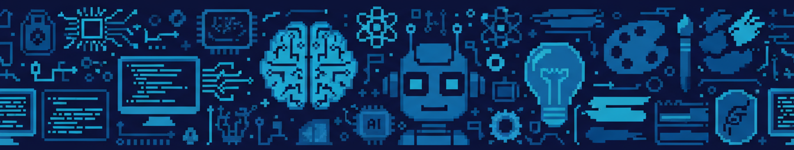
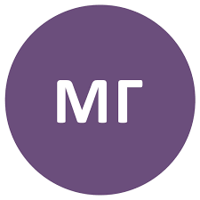
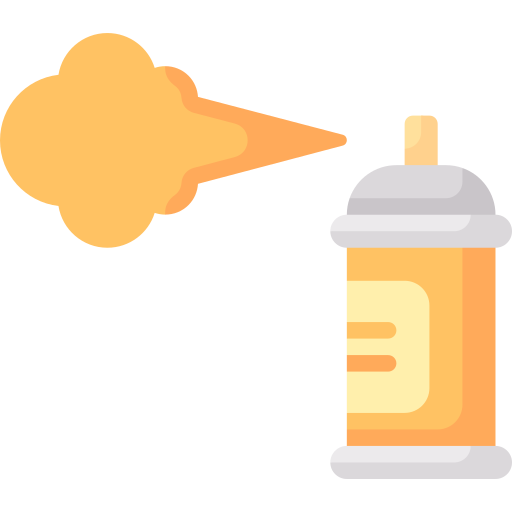
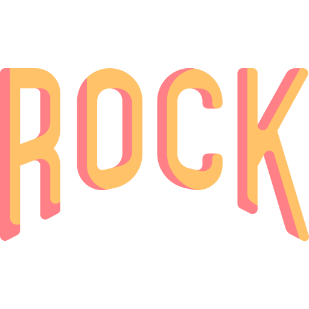
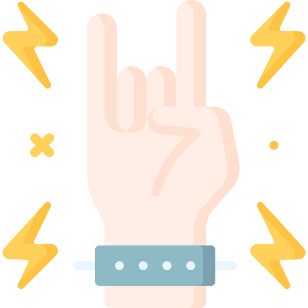
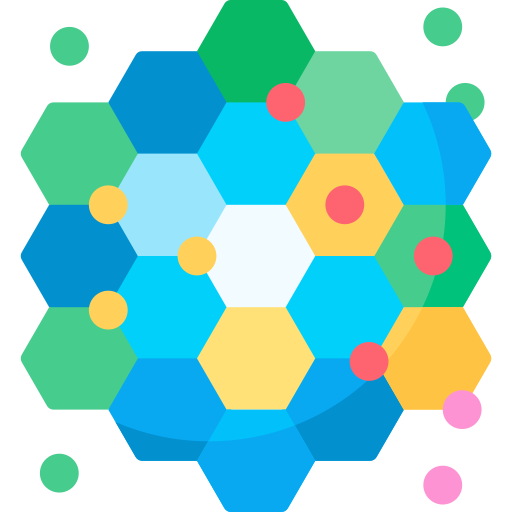
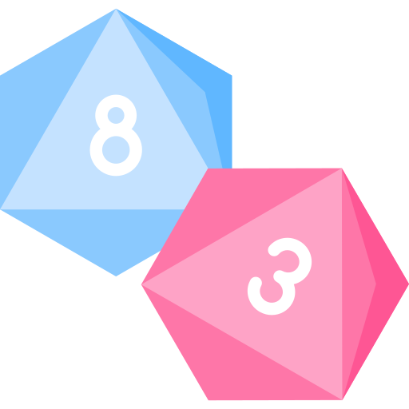

# Hey, I'm Lea!

//&nbsp; I'm a final year **software engineering student**, undergraduate teaching assistant and student mentor.  

//&nbsp; I love taking on challenges, experimenting with new ideas and turning cool concepts into reality.

 

### Education  

<table>
  <tr>
    <td>
      
    </td>
    <td>
      <strong>Mathematical Grammar School</strong>, Belgrade, Serbia 
      GPA:&nbsp; 5.0 / 5.0 &nbsp;|&nbsp; 2018 – 2022
    </td>
  </tr>
  <tr>
    <td>
      
    </td>
    <td>
      <strong>BS of Software Engineering</strong>, University of Belgrade, Faculty of Electrical Engineering, Belgrade, Serbia 
      GPA: 9.2 / 10.0 &nbsp;|&nbsp; 2022 – 2026
    </td>
  </tr>
</table>

 

### Skills 

&nbsp;&nbsp;&nbsp;&nbsp;&nbsp;&nbsp;&nbsp;// **Languages**

  

&nbsp;&nbsp;&nbsp;&nbsp;&nbsp;&nbsp;&nbsp;// **Frameworks & Libraries**

  

&nbsp;&nbsp;&nbsp;&nbsp;&nbsp;&nbsp;&nbsp;// **Tools & Servies**

  

&nbsp;&nbsp;&nbsp;&nbsp;&nbsp;&nbsp;&nbsp;& more

 

### Awards

<table> 
    <tr> 
        <td></td> 
        <td>1st Place in Regional (Belgrade) Programming Competition 2016</td> 
    </tr> 
    <tr> 
        <td></td> 
        <td>2nd Place in National Physics Competition 2016</td> 
    </tr> 
    <tr> 
        <td></td> 
        <td>3rd Place in National Mathematics Competition 2016</td>
    </tr> 
    <tr> 
        <td></td> 
        <td>3rd Place in National Physics Competition 2017</td> 
    </tr> 
    <tr> 
        <td></td> 
        <td>3rd Place in National Mathematics Competition 2017</td> 
    </tr> 
    <tr> 
        <td></td> 
        <td>2nd Place in National Physics Competition 2018</td> 
    </tr> 
    <tr> 
        <td></td> 
        <td>1st Place in Regional (Belgrade) Mathematics Competition 2018</td> 
    </tr> 
    <tr> 
        <td></td> 
        <td>Awarded at Serbian Physics Olympics 2018</td> 
    </tr> 
</table>

  

### Hobbies & Interests  

<table> 
    <tr> 
        <td>&nbsp;&nbsp;&nbsp;&nbsp;</td> 
        <td>&nbsp;&nbsp;&nbsp;&nbsp;</td> 
        <td>&nbsp;&nbsp;&nbsp;&nbsp;</td> 
        <td>&nbsp;&nbsp;&nbsp;&nbsp;</td> 
        <td>&nbsp;&nbsp;&nbsp;&nbsp;</td> 
    </tr> 
    <tr> 
        <td>Arts & Crafts</td> 
        <td>Playing Guitar</td> 
        <td>Travelling</td> 
        <td>Going to Concerts</td> 
        <td>Playing Board Games</td> 
    </tr> 
</table>

